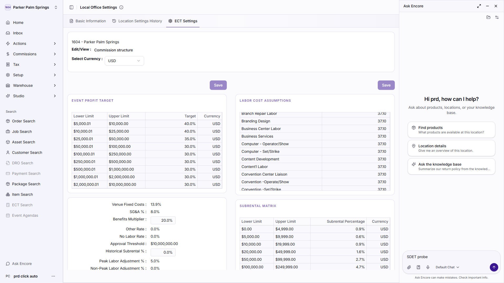
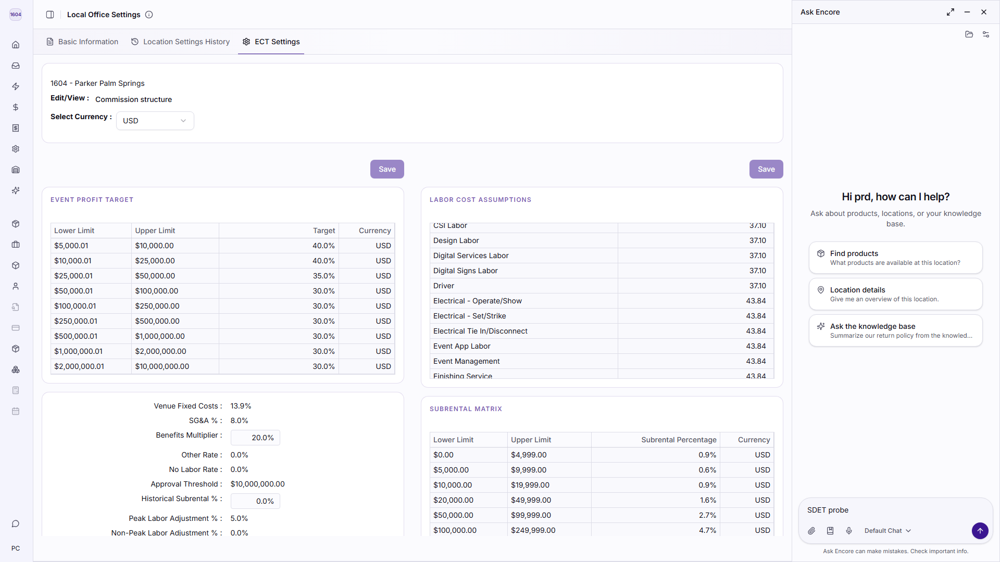
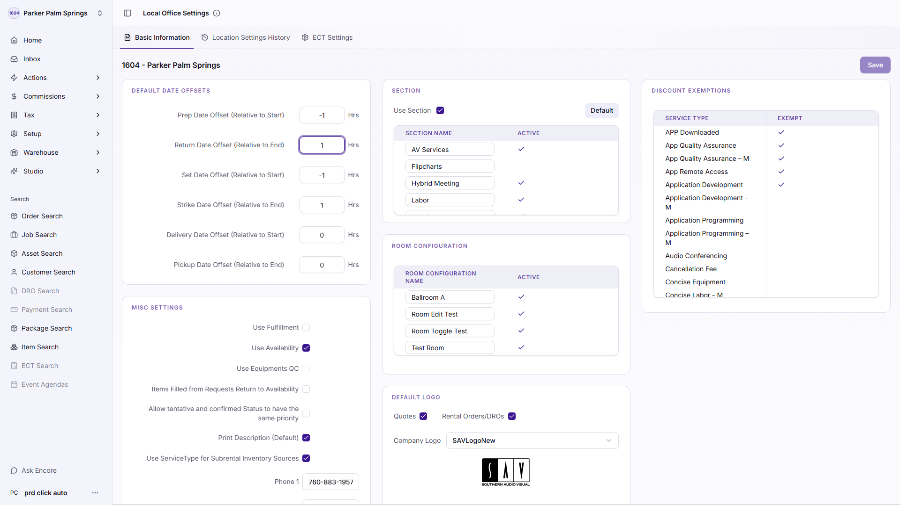
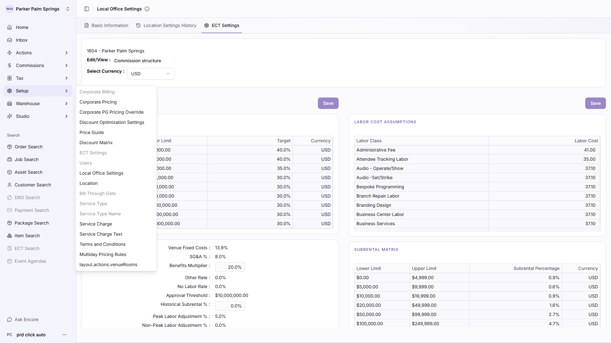

# Exploratory Crawl — Bug Report

**Application:** https://cloudapps-e2e.encoreglobal.com/navigator/locations/1604/settings/local-office
**Run:** 2026-09-17T16:58:25.714Z → 2026-09-17T17:00:32.824Z (127s)
**Stopped because:** completed — frontier exhausted

| | |
| --- | --- |
| Pages visited | 1 |
| Actions performed | 86 |
| Scenarios explored | 37 |
| **Bugs found** | **5** |
| Raw findings before dedup | 8 |
| Crawl errors | 0 |
| Pages/actions not tested | 16 |

## Severity

| Severity | Count |
| --- | --- |
| Critical | 0 |
| Major | 2 |
| Minor | 3 |
| Trivial | 0 |

## Category

| Category | Count |
| --- | --- |
| Functional | 2 |
| Accessibility | 1 |
| UI | 1 |
| Data | 1 |

## Bugs

| ID | Severity | Priority | Module | Title | Seen |
| --- | --- | --- | --- | --- | --- |
| BUG-CTRL-001 | Major | P2 | Local Office | "Click to restore sidebar" does nothing when clicked | 1x |
| BUG-CTRL-002 | Major | P2 | Local Office | "More information" does nothing when clicked | 1x |
| BUG-LABEL-001 | Minor | P3 | Local Office | 28 form control(s) have no accessible label on Local Office | 3x |
| BUG-LAYOUT-001 | Minor | P3 | Local Office | Interactive elements overlap on Local Office | 2x |
| BUG-TEXT-001 | Minor | P3 | Local Office | untranslated i18n key visible on Local Office | 1x |

### BUG-CTRL-001 — "Click to restore sidebar" does nothing when clicked

| Field | Value |
| --- | --- |
| **Severity** | Major |
| **Priority** | P2 |
| **Category** | Functional |
| **Module / Page** | Local Office |
| **URL** | https://cloudapps-e2e.encoreglobal.com/navigator/locations/1604/settings/local-office |
| **Detector** | `dead-control` |
| **Occurrences** | 1 |

**Preconditions**

- Signed in to the application with the automation account.
- Application reachable at https://cloudapps-e2e.encoreglobal.com.
- Screen under test: Local Office.

**Steps to reproduce**

1. Open https://cloudapps-e2e.encoreglobal.com/navigator/locations/1604/settings/local-office
2. Click "Click to restore sidebar".
3. Observe that nothing on the page changes.

**Expected result:** Clicking the button navigates, opens something, or changes what is on screen.

**Actual result:** After the click the URL is unchanged, no dialog opened, and the page content is byte-identical — the control has no visible effect.

**Evidence:** 

**Selector:** `div:nth-of-type(1) > div:nth-of-type(2) > div > button`

---

### BUG-CTRL-002 — "More information" does nothing when clicked

| Field | Value |
| --- | --- |
| **Severity** | Major |
| **Priority** | P2 |
| **Category** | Functional |
| **Module / Page** | Local Office |
| **URL** | https://cloudapps-e2e.encoreglobal.com/navigator/locations/1604/settings/local-office |
| **Detector** | `dead-control` |
| **Occurrences** | 1 |

**Preconditions**

- Signed in to the application with the automation account.
- Application reachable at https://cloudapps-e2e.encoreglobal.com.
- Screen under test: Local Office.

**Steps to reproduce**

1. Open https://cloudapps-e2e.encoreglobal.com/navigator/locations/1604/settings/local-office
2. Click "More information".
3. Observe that nothing on the page changes.

**Expected result:** Clicking the button navigates, opens something, or changes what is on screen.

**Actual result:** After the click the URL is unchanged, no dialog opened, and the page content is byte-identical — the control has no visible effect.

**Evidence:** 

**Selector:** `div > div:nth-of-type(2) > div > button`

---

### BUG-LABEL-001 — 28 form control(s) have no accessible label on Local Office

| Field | Value |
| --- | --- |
| **Severity** | Minor |
| **Priority** | P3 |
| **Category** | Accessibility |
| **Module / Page** | Local Office |
| **URL** | https://cloudapps-e2e.encoreglobal.com/navigator/locations/1604/settings/local-office |
| **Detector** | `missing-label` |
| **Occurrences** | 3 |

**Preconditions**

- Signed in to the application with the automation account.
- Application reachable at https://cloudapps-e2e.encoreglobal.com.
- Screen under test: Local Office.

**Steps to reproduce**

1. Open https://cloudapps-e2e.encoreglobal.com/navigator/locations/1604/settings/local-office
2. Inspect the form controls listed above and confirm none carries a label association.

**Expected result:** Every form control is named by a <label for>, aria-label or aria-labelledby, so assistive technology can announce it.

**Actual result:** 28 control(s) are named only by placeholder text or by nothing at all: input (-1); input (1); input (-1); input (1); input (0)

**Evidence:** 

**Selector:** `[data-testid="local-office-settings-input-prep-date-offset"]`

**Also seen on**

- Local Office > Location Settings History — https://cloudapps-e2e.encoreglobal.com/navigator/locations/1604/settings/local-office
- Local Office > Basic Information — https://cloudapps-e2e.encoreglobal.com/navigator/locations/1604/settings/local-office

---

### BUG-LAYOUT-001 — Interactive elements overlap on Local Office

| Field | Value |
| --- | --- |
| **Severity** | Minor |
| **Priority** | P3 |
| **Category** | UI |
| **Module / Page** | Local Office |
| **URL** | https://cloudapps-e2e.encoreglobal.com/navigator/locations/1604/settings/local-office |
| **Detector** | `layout` |
| **Occurrences** | 2 |

**Preconditions**

- Signed in to the application with the automation account.
- Application reachable at https://cloudapps-e2e.encoreglobal.com.
- Screen under test: Local Office.

**Steps to reproduce**

1. Open https://cloudapps-e2e.encoreglobal.com/navigator/locations/1604/settings/local-office

**Expected result:** Controls do not sit on top of one another — an overlapped control cannot be clicked reliably.

**Actual result:** 1 overlapping pair(s). Worst: button "Click to restore sidebar" over form "1604 - Parker Palm Springs Save DEFAULT " (39% covered).

**Evidence:** 

**Also seen on**

- Local Office > Basic Information — https://cloudapps-e2e.encoreglobal.com/navigator/locations/1604/settings/local-office

---

### BUG-TEXT-001 — untranslated i18n key visible on Local Office

| Field | Value |
| --- | --- |
| **Severity** | Minor |
| **Priority** | P3 |
| **Category** | Data |
| **Module / Page** | Local Office |
| **URL** | https://cloudapps-e2e.encoreglobal.com/navigator/locations/1604/settings/local-office |
| **Detector** | `placeholder-text` |
| **Occurrences** | 1 |

**Preconditions**

- Signed in to the application with the automation account.
- Application reachable at https://cloudapps-e2e.encoreglobal.com.
- Screen under test: Local Office.

**Steps to reproduce**

1. Open https://cloudapps-e2e.encoreglobal.com/navigator/locations/1604/settings/local-office
2. Click "Setup".
3. Read the page text and locate: untranslated i18n key: "layout.actions.venueRooms" (1x)

**Expected result:** Every value shown to a user is a resolved, translated, formatted value.

**Actual result:** The screen renders untranslated i18n key: "layout.actions.venueRooms" (1x).

**Evidence:** 

---

## Coverage

### Pages visited

| # | Module | URL | Depth | Elements | Actions | Bugs | Reached via |
| --- | --- | --- | --- | --- | --- | --- | --- |
| 1 | Local Office | https://cloudapps-e2e.encoreglobal.com/navigator/locations/1604/settings/local-office | 0 | 78 | 86 | 8 | start URL |

### Scenarios explored

| Scenario | Outcome | Detail |
| --- | --- | --- |
| Exercise tab: Location Settings History | explored | The screen re-rendered in response. |
| Exercise tab: Basic Information | explored | The screen re-rendered in response. |
| Exercise tab: ECT Settings | explored | The screen re-rendered in response. |
| Exercise select: Select Currency : | explored | The screen re-rendered in response. |
| Open dialog from 1604 Parker Palm Springs | explored | Dialog opened, inspected and dismissed with Escape. |
| Open dialog from Actions | explored | Dialog opened, inspected and dismissed with Escape. |
| Open dialog from Commissions | explored | Dialog opened, inspected and dismissed with Escape. |
| Open dialog from Tax | explored | Dialog opened, inspected and dismissed with Escape. |
| Open dialog from Setup | explored | Dialog opened, inspected and dismissed with Escape. |
| Open dialog from Warehouse | explored | Dialog opened, inspected and dismissed with Escape. |
| Open dialog from Studio | explored | Dialog opened, inspected and dismissed with Escape. |
| Exercise input: 20.0% | explored | The screen re-rendered in response. |
| Exercise button: Ask Encore | explored | The screen re-rendered in response. |
| Exercise textarea: input | explored | The screen re-rendered in response. |
| Open dialog from PC prd click auto | explored | Dialog opened, inspected and dismissed with Escape. |
| Exercise input: 37.10 | explored | The screen re-rendered in response. |
| Exercise input: 37.10 | explored | The screen re-rendered in response. |
| Exercise input: 37.10 | explored | The screen re-rendered in response. |
| Exercise input: 37.10 | explored | The screen re-rendered in response. |
| Exercise button: trigger-button | explored | The screen re-rendered in response. |
| Exercise input: 37.10 | explored | The screen re-rendered in response. |
| Exercise input: 43.84 | explored | The screen re-rendered in response. |
| Exercise input: 43.84 | explored | The screen re-rendered in response. |
| Exercise input: 24.44 | explored | The screen re-rendered in response. |
| Exercise input: 41.00 | explored | The screen re-rendered in response. |
| Exercise input: 37.10 | explored | The screen re-rendered in response. |
| Exercise input: 37.10 | explored | The screen re-rendered in response. |
| Exercise input: 43.84 | explored | The screen re-rendered in response. |
| Exercise input: 43.84 | explored | The screen re-rendered in response. |
| Exercise input: 43.84 | explored | The screen re-rendered in response. |
| Exercise input: 43.84 | explored | The screen re-rendered in response. |
| Exercise input: 43.84 | explored | The screen re-rendered in response. |
| Exercise input: 43.84 | explored | The screen re-rendered in response. |
| Exercise input: 43.84 | explored | The screen re-rendered in response. |
| Exercise input: 37.10 | explored | The screen re-rendered in response. |
| Exercise input: 37.10 | explored | The screen re-rendered in response. |
| Navigate via button: Full Screen | explored | Landed on https://cloudapps-e2e.encoreglobal.com/navigator/locations/1604/chat/00000000-0000-0000-0000-000000000000 |

### Not tested

These were discovered but deliberately or unavoidably left alone. Anything here is a gap in
the crawl, not a clean bill of health.

| Target | Reason |
| --- | --- |
| https://cloudapps-e2e.encoreglobal.com/navigator/locations/1604/home | does not match any include pattern |
| https://cloudapps-e2e.encoreglobal.com/navigator/locations/1604/inbox | does not match any include pattern |
| https://cloudapps-e2e.encoreglobal.com/navigator/locations/1604/orders | does not match any include pattern |
| https://cloudapps-e2e.encoreglobal.com/navigator/locations/1604/fulfillments | does not match any include pattern |
| https://cloudapps-e2e.encoreglobal.com/navigator/locations/1604/assets | does not match any include pattern |
| https://cloudapps-e2e.encoreglobal.com/navigator/locations/1604/customers | does not match any include pattern |
| https://cloudapps-e2e.encoreglobal.com/navigator/locations/1604/packages | does not match any include pattern |
| https://cloudapps-e2e.encoreglobal.com/navigator/locations/1604/products | does not match any include pattern |
| https://cloudapps-e2e.encoreglobal.com/navigator/locations/1604/settings/local-office :: Open the "Basic Information" tab. | tab is already the selected one |
| https://cloudapps-e2e.encoreglobal.com/navigator/locations/1604/settings/local-office :: Click "DRO Search". | control is disabled |
| https://cloudapps-e2e.encoreglobal.com/navigator/locations/1604/settings/local-office :: Click "Payment Search". | control is disabled |
| https://cloudapps-e2e.encoreglobal.com/navigator/locations/1604/settings/local-office :: Click "ECT Search". | control is disabled |
| https://cloudapps-e2e.encoreglobal.com/navigator/locations/1604/settings/local-office :: Click "Event Agendas". | control is disabled |
| https://cloudapps-e2e.encoreglobal.com/navigator/locations/1604/settings/local-office :: Click "Save". | control is disabled |
| https://cloudapps-e2e.encoreglobal.com/navigator/locations/1604/chat/00000000-0000-0000-0000-000000000000 | does not match any include pattern |
| https://cloudapps-e2e.encoreglobal.com/navigator/locations/1604/settings/local-office | remaining controls not exercised — "Full Screen" navigated away |

## What was checked

| Detector | Looks for |
| --- | --- |
| `page-crash` | The screen rendered a crash banner, a stack trace, or nothing at all. |
| `console-error` | The page logged an uncaught error or a console error while it was being used. |
| `network-failure` | A request the screen made failed, or answered 4xx/5xx. |
| `broken-link` | Links that point nowhere, and links whose destination answers 4xx/5xx. |
| `dead-control` | A control that neither navigates, opens anything, nor changes the page. |
| `unexpected-route` | Navigation that lands somewhere other than where the control advertised. |
| `form-validation` | Fields that accept a value their own type says is invalid, without telling the user. |
| `input-boundary` | Boundary values that make the screen throw, hang, or silently mangle the input. |
| `placeholder-text` | Unresolved values, i18n keys or template fragments rendered as user-visible text. |
| `missing-label` | Form controls a screen reader cannot announce, because nothing names them. |
| `accessibility` | Unnamed controls, missing image alternatives, absent headings, duplicate ids. |
| `layout` | Horizontal overflow, text clipped by its container, and controls that overlap. |
| `page-title` | The browser tab names the screen. |

## Configuration used

```json
{
  "startUrl": "https://cloudapps-e2e.encoreglobal.com/navigator/locations/1604/settings/local-office",
  "allowedOrigins": [
    "https://cloudapps-e2e.encoreglobal.com"
  ],
  "excludeUrlPatterns": [
    "logout",
    "signout",
    "sign-out",
    "\\/api\\/auth\\/signout",
    "login\\.microsoftonline\\.com",
    "b2clogin\\.com",
    "\\.(pdf|csv|xlsx|xls|zip|docx|png|jpe?g|gif|svg|woff2?|ttf)(\\?|$)",
    "^mailto:",
    "^tel:",
    "^javascript:",
    "\\/api\\/",
    "\\/_next\\/",
    "\\/auth\\/signin",
    "\\/reports\\/download"
  ],
  "includeUrlPatterns": [
    "settings\\/local-office"
  ],
  "auth": {
    "mode": "storage-state",
    "signedInSelector": "h1"
  },
  "limits": {
    "maxPages": 4,
    "maxActionsPerPage": 110,
    "maxTotalActions": 120,
    "maxDepth": 1,
    "maxDurationMs": 900000,
    "settleMs": 900,
    "actionTimeoutMs": 8000,
    "navigationTimeoutMs": 30000
  },
  "safety": {
    "allowWrites": false,
    "allowDestructive": false
  },
  "enabledDetectors": [
    "page-crash",
    "console-error",
    "network-failure",
    "broken-link",
    "dead-control",
    "unexpected-route",
    "form-validation",
    "input-boundary",
    "placeholder-text",
    "missing-label",
    "accessibility",
    "layout",
    "page-title"
  ],
  "captureScreenshots": true,
  "outputDir": "reports/bugs/crawler/local-office-history"
}
```

